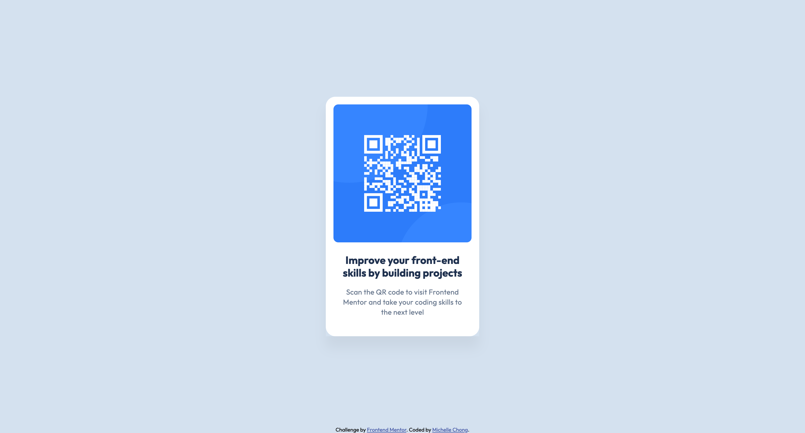

# Frontend Mentor - QR code component solution

This is a solution to the [QR code component challenge on Frontend Mentor](https://www.frontendmentor.io/challenges/qr-code-component-iux_sIO_H). Frontend Mentor challenges help you improve your coding skills by building realistic projects. 

## Table of contents

- [Overview](#overview)
  - [Screenshot](#screenshot)
  - [Links](#links)
- [My process](#my-process)
  - [Built with](#built-with)
  - [What I learned](#what-i-learned)
  - [Continued development](#continued-development)
  - [Useful resources](#useful-resources)
- [Author](#author)
- [Acknowledgments](#acknowledgments)

## Overview

### Screenshot




### Links

- Solution URL: (https://www.frontendmentor.io/solutions/qr-code-component-Z4OZ8G8IZM)
- Live Site URL: (https://mdchong.github.io/qr-code-component/)

## My process

### Built with

- Semantic HTML5 markup
- CSS
- Flexbox
- Mobile-first workflow

### What I learned

```html
<h1>Some HTML code I'm proud of</h1>

```
:root {
    /* Colors  */
    --white: #FFFFFF;
    --slate-300: #D5E1EF;
    --slate-500: #68778D;
    --slate-900: #1F314F;

    /* Typography  */
    --body-font: "Outfit", sans-serif;

    /* Outfit - Regular */
    --weight-regular: 400;
    --size-regular: 15px;
    --line-height-regular: 140%;
    --letter-spacing-regular: 0.2px;

    /* Outfit - Bold */
    --weight-bold: 700;
    --size-bold: 22px;
    --line-height-bold: 120%;
    --letter-spacing-bold: 0px;

    /* Spacing */
    --spacing-200: 1rem;
    --spacing-300: 1.5rem;
    --spacing-400: 2.5rem;
}

Usage of :root  to define CSS variables for colors, typography, and spacing!

html {
    background-color: var(--slate-300);
    height: 100vh;
    display: flex;
    justify-content: center;
    align-items: center;
}

Took me ages to discover why my flex was not working, but figured out it was to control the height of the html to make the card placed in the center!
```

### Continued development

I want to continue learning about the  different types of CSS variables, how to use them effectively, and how to apply them to real-world!
Also, what is necessary and unnecessary  in CSS, and how to optimize it for better performance!

## Author

- GitHub - [Michelle Chong](https://github.com/mdchong)
- Frontend Mentor - [@mdchong](https://www.frontendmentor.io/profile/mdchong)

## Acknowledgments
gx
tharun
Grace Snow